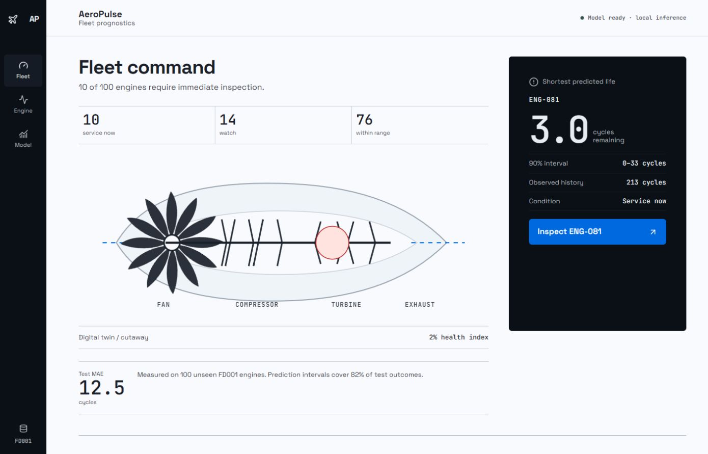
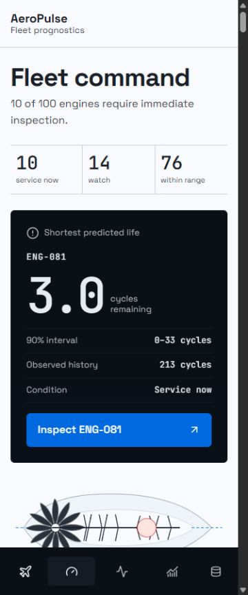
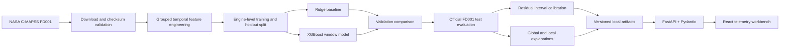

# AeroPulse

> Local-first predictive maintenance for turbofan engines, built with NASA C-MAPSS.

[](https://www.python.org/)
[](https://fastapi.tiangolo.com/)
[](https://react.dev/)
[](https://www.typescriptlang.org/)
[](https://xgboost.readthedocs.io/)
[](LICENSE)



AeroPulse transforms multivariate engine telemetry into an operational maintenance workspace. It estimates **remaining useful life (RUL)**, ranks a fleet by urgency, communicates uncertainty around each estimate, and explains the signals that influenced individual predictions.

This is an end-to-end machine-learning product rather than a standalone notebook. It includes reproducible data acquisition, leakage-safe temporal features, model comparison, uncertainty calibration, versioned inference artifacts, a typed FastAPI service, and a responsive React interface served from one local application.

No API key, cloud model, external database, or Streamlit runtime is required.

## Table of contents

- [Why this project](#why-this-project)
- [Key results](#key-results)
- [Product experience](#product-experience)
- [System architecture](#system-architecture)
- [Machine-learning pipeline](#machine-learning-pipeline)
- [Dataset](#dataset)
- [Technology stack](#technology-stack)
- [Getting started](#getting-started)
- [Reproducing the model](#reproducing-the-model)
- [API reference](#api-reference)
- [Testing and quality](#testing-and-quality)
- [Repository structure](#repository-structure)
- [Design and accessibility](#design-and-accessibility)
- [Limitations](#limitations)
- [Roadmap](#roadmap)
- [Author](#author)
- [License and attribution](#license-and-attribution)

## Why this project

Predictive maintenance is not only a regression problem. A useful system also needs to answer operational questions:

- Which asset should be inspected first?
- How much confidence should an operator place in a prediction?
- Which recent telemetry patterns influenced the estimate?
- How did the estimate change throughout the asset's observed life?
- Can the result be reproduced, inspected, and served without external infrastructure?

AeroPulse treats those questions as product requirements. The model output is translated into a fleet priority, a bounded health score, an uncertainty interval, a historical prediction series, and global and local feature explanations.

### Portfolio scope

| Capability | Implementation |
| --- | --- |
| Data engineering | Verified NASA download, schema validation, SHA-256 checksums, grouped temporal transforms |
| Machine learning | Ridge baseline, XGBoost candidate, engine-level holdout, official FD001 test evaluation |
| Model interpretation | Global feature importance and per-engine additive XGBoost contributions |
| Uncertainty | Holdout-residual prediction interval with measured test coverage |
| Backend | Typed FastAPI routes backed by versioned local artifacts |
| Frontend | React 19 telemetry workbench with responsive navigation and charts |
| Delivery | Single-service production build, Docker, automated tests, linting, and type checking |

## Key results

All metrics are generated by `scripts/train.py` from NASA C-MAPSS FD001. Model selection uses the final 20 training engines as a holdout; the official test targets remain separate until final evaluation.

| Model | Validation RMSE | Validation MAE | Validation NASA score | Test RMSE | Test MAE | Test NASA score |
| --- | ---: | ---: | ---: | ---: | ---: | ---: |
| Ridge baseline | 18.696 | 14.096 | 23,926.568 | — | — | — |
| **XGBoost window model** | **16.935** | **11.995** | **20,650.310** | **17.154** | **12.485** | **424.067** |

### Evaluation summary

| Item | Value |
| --- | ---: |
| Training observations | 16,138 |
| Validation observations | 4,493 |
| Official test engines | 100 |
| Engine telemetry features | 116 |
| RUL target cap | 125 cycles |
| Prediction-interval radius | ±29.9 cycles |
| Test interval coverage | 82% |

RMSE and MAE are reported in operating cycles. The NASA score applies an asymmetric exponential penalty: late predictions are penalized more heavily than early predictions because overestimating remaining life is the more dangerous maintenance error.

The prediction interval uses the 90th percentile of absolute validation residuals. Its measured coverage on the 100 official test engines is **82%**, below the nominal 90% target. AeroPulse reports that gap directly: it indicates holdout-to-test distribution shift and motivates conditional or conformal calibration in future work.

## Product experience

The application is organized into four workspaces.

### 1. Fleet command

The landing view answers the most urgent question first: which engines require attention?

- Ranks all 100 test engines by predicted RUL.
- Summarizes critical, watch, and stable conditions.
- Highlights the shortest predicted life and its uncertainty interval.
- Displays observed cycles, health score, actual RUL, and absolute error.
- Opens any asset directly in the engine workspace.

Risk bands are deterministic and intentionally visible:

| Band | Predicted RUL | Interface label |
| --- | ---: | --- |
| Critical | ≤ 15 cycles | Service now |
| Watch | > 15 and ≤ 40 cycles | Watch closely |
| Stable | > 40 cycles | Within range |

### 2. Engine profile

The engine view combines prediction history and telemetry context.

- Replays the asset trajectory with a cycle slider.
- Shows the point estimate and bounded prediction interval through time.
- Plots six high-value physical sensor series selected from model importance.
- Presents a turbofan condition schematic as a visual anchor.
- Lists the six strongest local feature contributions and whether each one extends or reduces predicted life.

### 3. Model lab

The model workspace makes evaluation evidence visible inside the product.

- Compares the Ridge baseline with the selected XGBoost model.
- Reports validation and official test metrics.
- Documents target construction, dataset sizes, and interval coverage.
- Displays normalized global feature importance.
- Keeps the model's intended scope and limitations beside the results.

### 4. API docs

The documentation workspace reads the live FastAPI contract from `/openapi.json`.

- Provides searchable endpoint documentation inside the AeroPulse interface.
- Lists HTTP methods, paths, parameters, requirements, and responses.
- Links to generated Swagger UI and ReDoc references.
- Updates automatically when the backend OpenAPI schema changes.

### Responsive interface



The graphite side rail becomes a four-destination bottom navigation on smaller screens. Dense fleet rows switch to touch-friendly cards without removing operational context.

## System architecture



### Runtime model

The training pipeline writes compact, UI-ready artifacts. The production service reads those artifacts instead of retraining or performing expensive transformations at startup.

```text
model.joblib
    Trained estimator, feature builder, feature order, interval radius, dataset metadata

fleet.json
    Fleet summary and the final prediction for every official test engine

model_report.json
    Candidate metrics, selected model, feature importance, and limitations

engines/{engine_id}.json
    Prediction trajectory, sensor traces, and local contributions for one engine
```

FastAPI serves both the JSON API and the compiled React frontend. This keeps local deployment to one process and one port.

## Machine-learning pipeline

### 1. Data validation

The downloader first attempts the NASA source of record and uses a public mirror only as a network fallback. Before any data is accepted, it verifies:

- Required FD001 files are present.
- Expected row and column counts match.
- Pinned SHA-256 checksums match the known files.
- ZIP entries cannot escape the destination directory during extraction.

The selected source and hashes are recorded in `data/raw/SOURCE.json`.

### 2. Target construction

For every training observation:

```text
RUL = final cycle for the engine - current cycle
capped RUL = min(RUL, 125)
```

The cap represents the early-life region where exact long-range degradation timing is not operationally meaningful and prevents large healthy-life targets from dominating the loss.

### 3. Feature engineering

Fourteen informative physical sensors are retained. Every temporal operation is grouped by `engine_id`, preventing values from one engine from leaking into another.

The 116-feature matrix contains:

- Current operating cycle and three operating settings.
- Current values for 14 informative sensors.
- One-cycle sensor differences.
- Rolling mean and standard deviation over 5 and 20 cycles.
- Rolling sensor trends over 5 and 20 cycles.

Rolling windows use available history at the beginning of each trajectory, so the model can produce estimates from the first observed cycle.

### 4. Leakage-safe validation

The first 80 training engines are used for fitting and the final 20 training engines are held out for model selection and interval calibration. No engine appears in both groups. This is stricter than a random row split, which would expose portions of the same degradation trajectory to training and validation.

### 5. Candidate models

| Candidate | Purpose | Main configuration |
| --- | --- | --- |
| Ridge regression | Interpretable standardized linear baseline | `alpha=10.0` |
| XGBoost regressor | Nonlinear window-feature model | 450 trees, depth 5, learning rate 0.035 |

Predictions are bounded to the target range of 0–125 cycles. The candidate with the lowest holdout RMSE is selected.

### 6. Uncertainty and explanations

The fixed interval radius is computed only from holdout residuals and clipped to the target range. The system also exports:

- Normalized global model importance for the 12 highest-ranked engineered features.
- Per-engine additive contribution values from XGBoost's `pred_contribs` output.
- Human-readable feature labels that connect rolling features to physical sensor names.

These explanations describe model behavior, not physical causality.

## Dataset

AeroPulse uses **FD001** from the NASA Commercial Modular Aero-Propulsion System Simulation dataset.

| Property | FD001 |
| --- | ---: |
| Operating conditions | 1 |
| Fault modes | 1 — HPC degradation |
| Training engines | 100 run-to-failure trajectories |
| Test engines | 100 truncated trajectories |
| Training rows | 20,631 |
| Test rows | 13,096 |
| Original columns | 26 |

Each row represents one operating cycle and contains an engine identifier, cycle number, three operating settings, and 21 sensor measurements. Ground-truth RUL for each truncated test trajectory is supplied separately.

Source of record: [NASA C-MAPSS Jet Engine Simulated Data](https://data.nasa.gov/dataset/cmapss-jet-engine-simulated-data).

## Technology stack

| Layer | Technology |
| --- | --- |
| Data and ML | Python 3.12, pandas, NumPy, scikit-learn, XGBoost, joblib |
| API | FastAPI, Pydantic, Uvicorn |
| Frontend | React 19, TypeScript, Vite, Recharts, Lucide |
| Styling | Custom CSS, semantic OKLCH design tokens, local font packages |
| Python quality | pytest, Ruff, ty |
| Frontend quality | Vitest, Testing Library, ESLint, TypeScript |
| Dependency management | uv, npm |
| Delivery | Docker, Docker Compose, multi-stage production image |

## Getting started

The repository includes the trained model and generated JSON artifacts. You can run the complete application without downloading the dataset or retraining.

### Prerequisites

- Python 3.12
- [uv](https://docs.astral.sh/uv/)
- Node.js 24 or later
- npm

### Local production build

From the repository root:

```bash
uv sync --dev
cd frontend
npm ci
npm run build
cd ..
uv run uvicorn aeropulse_api.main:app --host 127.0.0.1 --port 8000
```

Open the application at [http://127.0.0.1:8000](http://127.0.0.1:8000).

### Frontend development

Run the backend and Vite server in separate terminals.

Terminal 1:

```bash
uv run uvicorn aeropulse_api.main:app --reload --host 127.0.0.1 --port 8000
```

Terminal 2:

```bash
cd frontend
npm ci
npm run dev
```

Open [http://127.0.0.1:5173](http://127.0.0.1:5173). Vite proxies `/api` and `/openapi.json` to the local FastAPI process.

### Docker

```bash
docker compose up --build
```

Open [http://127.0.0.1:8000](http://127.0.0.1:8000).

The multi-stage image builds the React application with Node 24, installs the Python package into a slim Python 3.12 runtime, copies the trained artifacts, and exposes a single service on port `8000`.

To stop the service:

```bash
docker compose down
```

### No credentials required

AeroPulse is fully local and does not call an inference API. There are no required secrets or API keys. Host and port are selected through the Uvicorn CLI flags or Docker port mapping.

## Reproducing the model

### Download and verify FD001

```bash
uv run python scripts/download_data.py
```

The downloader is idempotent: verified files are reused. To intentionally replace the local raw files:

```bash
uv run python scripts/download_data.py --force
```

### Train and export artifacts

```bash
uv run python scripts/train.py
```

The command trains both candidates, selects the best validation model, evaluates the official test set, calibrates the interval, and rewrites the contents of `artifacts/`.

Expected terminal summary:

```text
Selected model: XGBoost window model
Test RMSE: 17.154
Test MAE: 12.485
Artifacts written to .../artifacts
```

Training defaults live in the immutable `TrainingConfig` dataclass:

| Parameter | Default |
| --- | ---: |
| Dataset | FD001 |
| RUL cap | 125 cycles |
| Validation engines | 20 |
| Interval confidence target | 0.90 |
| Random seed | 42 |

## API reference

The application includes four complementary documentation entry points:

- **In-app Docs:** select `Docs` in the AeroPulse navigation.
- **Swagger UI:** [http://127.0.0.1:8000/docs](http://127.0.0.1:8000/docs)
- **ReDoc:** [http://127.0.0.1:8000/redoc](http://127.0.0.1:8000/redoc)
- **OpenAPI contract:** [http://127.0.0.1:8000/openapi.json](http://127.0.0.1:8000/openapi.json)

### Endpoints

| Method | Endpoint | Success response | Purpose |
| --- | --- | --- | --- |
| `GET` | `/api/health` | `200` | Service health and artifact readiness |
| `GET` | `/api/fleet` | `200` | Fleet summary and all final engine predictions |
| `GET` | `/api/engines/{engine_id}` | `200` | One engine's predictions, sensors, and local contributions |
| `GET` | `/api/model` | `200` | Candidate metrics, importance, and model limitations |

`/api/fleet` and `/api/model` return `503` when their artifacts are unavailable. An unknown engine identifier returns `404`, and an invalid identifier returns FastAPI's `422` validation response.

### Example requests

Health check:

```bash
curl http://127.0.0.1:8000/api/health
```

```json
{
  "status": "ok",
  "dataset": "FD001",
  "artifacts_ready": true
}
```

Retrieve fleet predictions:

```bash
curl http://127.0.0.1:8000/api/fleet
```

Inspect engine 81:

```bash
curl http://127.0.0.1:8000/api/engines/81
```

Retrieve the model report:

```bash
curl http://127.0.0.1:8000/api/model
```

All application endpoints are read-only. Response schemas are defined with Pydantic and published automatically through OpenAPI 3.1.

## Testing and quality

### Python

```bash
uv run pytest
uv run pytest --cov
uv run ruff check .
uv run ruff format --check .
uv run ty check backend
```

The Python suite covers feature isolation, metric behavior, domain thresholds, health degradation, missing artifacts, and unknown-engine responses.

### Frontend

```bash
cd frontend
npm test
npm run lint
npm run build
npm audit --audit-level=moderate
```

The frontend suite covers risk presentation, fleet filtering, OpenAPI operation extraction, and API documentation search behavior.

### Current verified state

- 8 Python tests passing.
- 5 React tests passing.
- Ruff, ty, ESLint, and TypeScript checks passing.
- Production frontend build passing.
- npm audit reporting zero known vulnerabilities at moderate severity or higher.
- Responsive layout checked at 320, 375, 414, 768, and 1440 CSS pixels.

## Repository structure

```text
aeropulse/
├── artifacts/
│   ├── engines/                # UI-ready detail payload for every test engine
│   ├── fleet.json              # Ranked fleet predictions and summary
│   ├── model.joblib            # Trained estimator and feature metadata
│   └── model_report.json       # Metrics, importance, and limitations
├── backend/aeropulse_api/
│   ├── api/                    # Health, fleet, engine, and model routes
│   ├── ml/                     # Data loading, features, metrics, and training
│   ├── domain.py               # Risk and health-score rules
│   ├── repository.py           # Artifact access boundary
│   └── schemas.py              # Pydantic response contracts
├── data/raw/                   # Verified FD001 files; large raw files ignored by Git
├── docs/images/                # Product screenshots
├── frontend/src/
│   ├── components/             # Fleet, engine, model, shell, and API docs views
│   ├── lib/                    # API client and deterministic UI helpers
│   └── styles.css              # Responsive interface implementation
├── scripts/
│   ├── download_data.py        # Verified and idempotent data acquisition
│   └── train.py                # Reproducible training entry point
├── tests/                      # Python unit and API tests
├── DESIGN.md                   # Visual language and component rules
├── PRODUCT.md                  # Product intent and operational constraints
├── LINKEDIN_POST_PT_BR.md      # Portuguese launch-post draft
├── VIDEO_SCRIPT_PT_BR.md       # Portuguese product-demo script
├── Dockerfile                  # Multi-stage production image
├── docker-compose.yml
├── pyproject.toml
└── README.md
```

## Design and accessibility

AeroPulse uses a restrained engineering-console visual language designed for recorded product demonstrations and real operational scanning.

- Space Grotesk for interface copy and JetBrains Mono for telemetry.
- Semantic OKLCH color tokens shared through a documented token system.
- Risk labels that include text and never depend on color alone.
- Keyboard-visible focus states and semantic landmarks.
- Minimum 44-pixel interactive targets.
- Responsive table-to-card behavior on narrow screens.
- Reduced-motion support for the rotating fan visualization.
- No gradients, glass effects, or decorative dashboard clutter.

The full visual rationale is documented in `DESIGN.md`.

## Limitations

- C-MAPSS is a high-fidelity simulation, not live commercial-aircraft telemetry.
- The model is trained only on FD001: one operating condition and one fault mode.
- Results should not be assumed to generalize to FD002–FD004 or real engines.
- The interval uses one global residual radius and cannot express condition-dependent uncertainty.
- The 82% test coverage is below the nominal 90% calibration target.
- Global importance and local contributions explain the fitted model, not physical causality.
- The backend serves precomputed official-test artifacts; it is not currently a live telemetry ingestion service.
- AeroPulse is an educational portfolio system and is not safety-certified.

## Roadmap

- Add conditional conformal or conformalized-quantile prediction intervals.
- Benchmark generalization across FD002, FD003, and FD004.
- Compare the window model with a compact temporal convolutional network.
- Add a validated inference endpoint for new telemetry sequences.
- Track model and data drift for streamed sensor data.
- Export the selected estimator to ONNX for portable edge inference.
- Add CI workflows for Python, frontend, and container verification.

## Author

Built by **Diego Rodrilla Mirhan**, a Computer Science student focused on local-first AI, machine learning, and data products.

- Portfolio: [diegomirhan.com](https://diegomirhan.com)
- GitHub: [github.com/diegormirhan](https://github.com/diegormirhan)
- LinkedIn: [linkedin.com/in/diegomirhan](https://www.linkedin.com/in/diegomirhan)

## License and attribution

The AeroPulse source code is available under the [MIT License](LICENSE).

The C-MAPSS dataset was created by NASA and remains subject to NASA's data terms. The repository does not relicense the dataset. Consult the [NASA dataset page](https://data.nasa.gov/dataset/cmapss-jet-engine-simulated-data) for current attribution and usage guidance.

---

If AeroPulse is useful to you, consider starring the repository or opening an issue with feedback.
